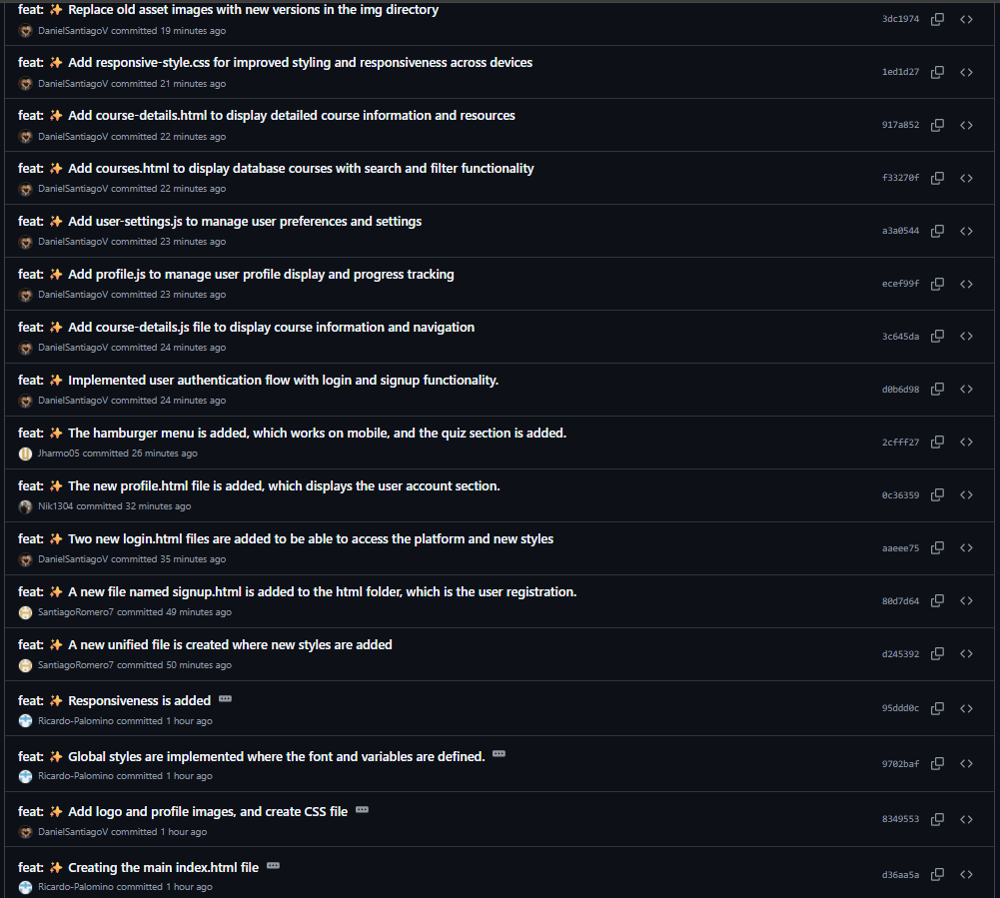
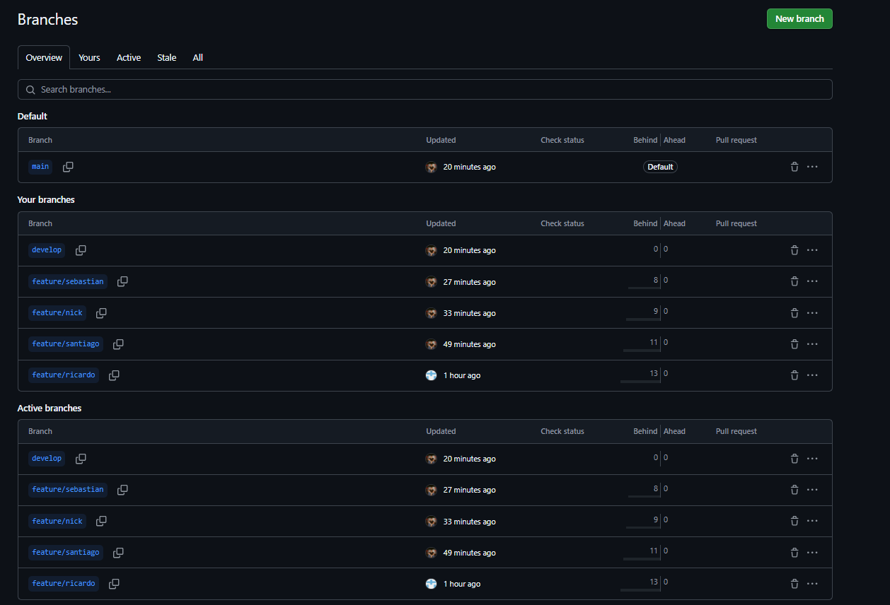
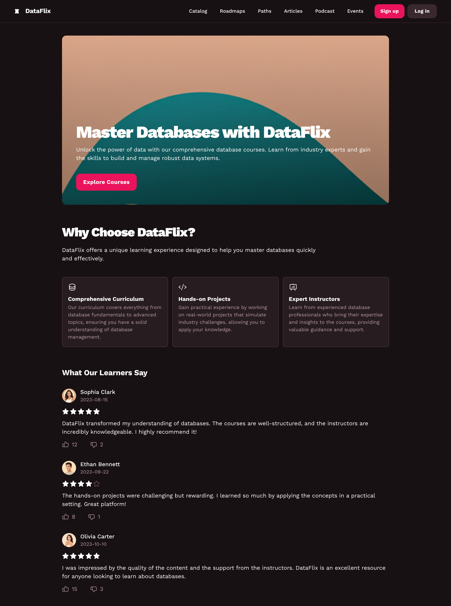
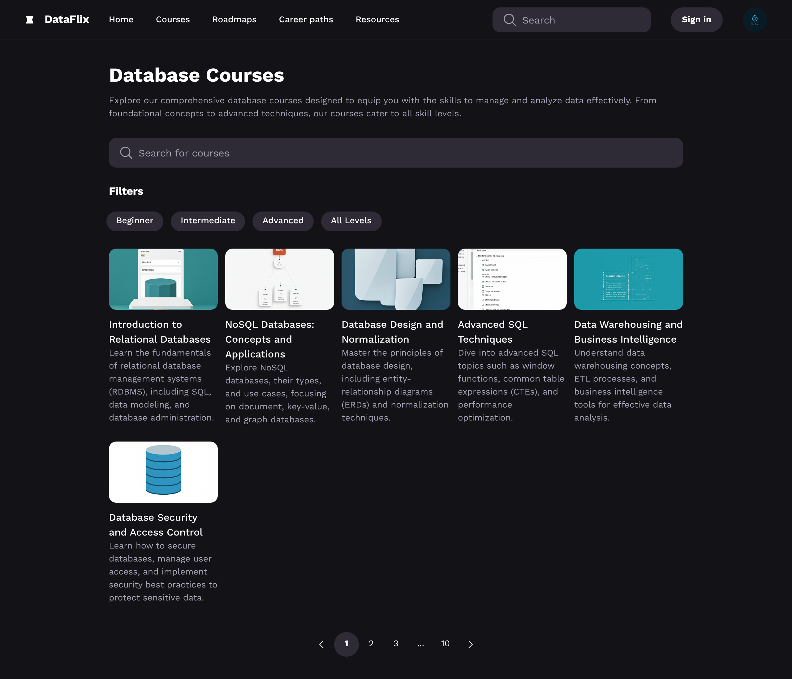
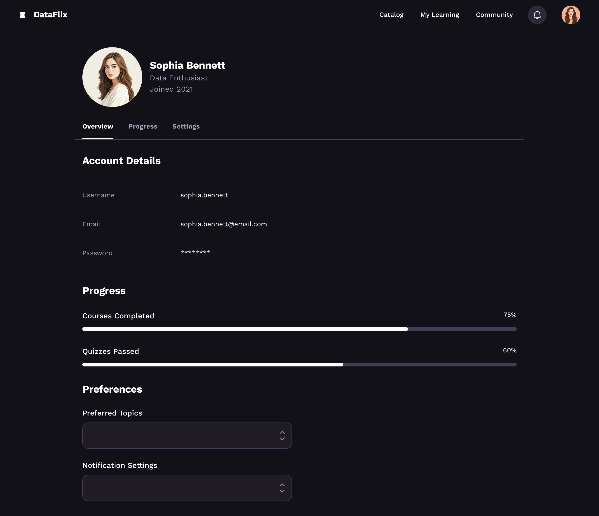
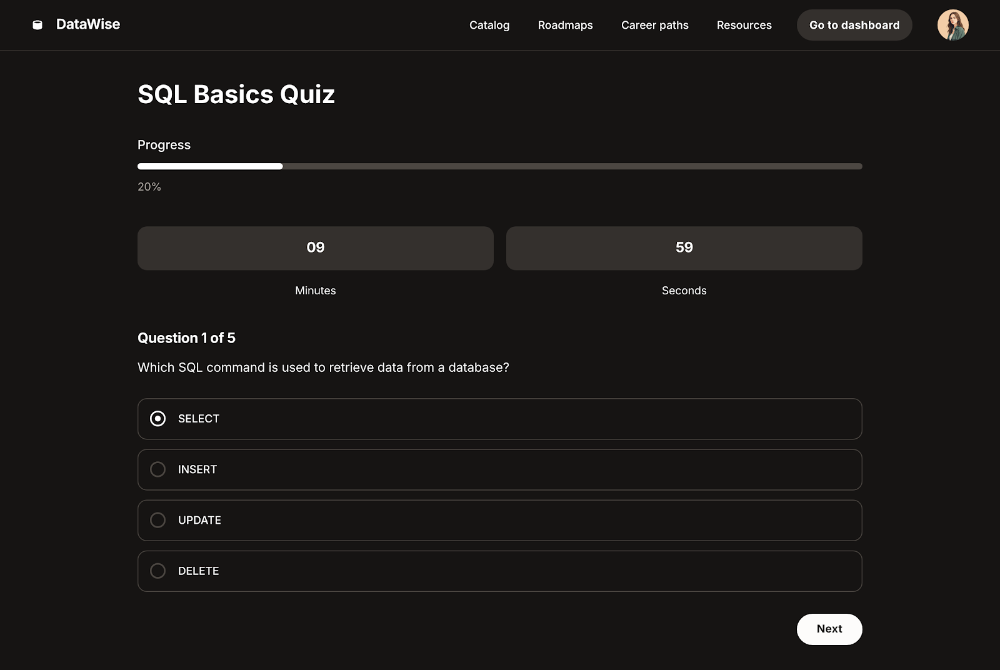

# DataFlix# 🎓 DataFlix - Plataforma Educativa de Bases de Datos

<p align="center"> 
   
</p>

<p align="center"> 
  
  
  
  
</p>

---

## 📝 Descripción del Proyecto

**DataFlix** es una plataforma web educativa diseñada para que cualquier persona pueda aprender bases de datos desde cero. El sitio ofrece cursos gratuitos, quizzes interactivos, seguimiento de progreso y un perfil de usuario personalizado. El objetivo es democratizar el acceso al conocimiento sobre bases de datos, motivando el aprendizaje autónomo y práctico a través de una experiencia moderna, visual y responsiva.

La plataforma está pensada tanto para estudiantes como para autodidactas, y puede ser utilizada en entornos educativos formales o como recurso de autoaprendizaje.

---

## 🎯 Enfoque del Proyecto

El desarrollo de DataFlix se realizó bajo un enfoque **ágil y colaborativo**, priorizando:
- **Usabilidad y experiencia de usuario**: Navegación clara, menús responsivos, feedback visual.
- **Aprendizaje progresivo**: Cursos estructurados, quizzes por módulo, perfil con progreso.
- **Buenas prácticas de desarrollo web**: Código modular, separación de responsabilidades, uso de SCRUM y Git colaborativo.
- **Accesibilidad y compatibilidad**: Mobile-first, contraste adecuado, navegación por teclado.

**Decisiones técnicas destacadas:**
- Uso de HTML5 semántico y CSS3 moderno (Flexbox, Grid, variables CSS).
- JavaScript vanilla para la lógica de quizzes, autenticación y navegación dinámica.
- Persistencia de datos en localStorage para quizzes y usuarios.
- Arquitectura de carpetas clara y escalable.

---

## 🚀 Instrucciones de Instalación y Uso

### Requisitos
- Navegador web moderno (Chrome, Firefox, Edge, Safari)
- No requiere backend ni instalación de dependencias

### Pasos para usar DataFlix
1. Clona el repositorio:
   ```bash
   git clone <url-del-repo>
   ```
2. Abre `index.html` en tu navegador preferido.
3. Navega por los cursos, realiza quizzes y revisa tu progreso en el perfil.

### Estructura de carpetas
```
dataflix/
├── index.html
├── html/
│   ├── courses.html
│   ├── course-details.html
│   ├── profile.html
│   ├── login.html
│   ├── signup.html
│   ├── quiz.html
│   └── quiz-results.html
├── css/
│   ├── main-style.css
│   ├── style.css
│   ├── style-unified.css
│   └── responsive-style.css
├── js/
│   ├── auth.js
│   ├── course-details.js
│   ├── menuhamburguer.js
│   └── profile.js
└── assets/
    └── img/
        └── profile.png
```

### Funcionalidades principales
- Registro e inicio de sesión de usuarios (localStorage)
- Visualización de cursos y detalles
- Realización de quizzes por módulo
- Seguimiento de progreso en el perfil
- Menú hamburguesa y navegación responsiva

---

## 👥 Integrantes del Equipo y Roles

### 🎯 Equipo de Desarrollo DataFlix

- **Daniel Santiago Viñasco** — **Product Owner & Project Manager**
  - Responsabilidades: Definición de requisitos, gestión del producto, coordinación general del proyecto
  - Tecnologías: Product Management, HTML5, CSS3, JavaScript, Git/GitHub
  - Contribuciones: Definición de funcionalidades, gestión de stakeholders, documentación del proyecto

- **Santiago Romero** — **Scrum Master & Full Stack Developer**
  - Responsabilidades: Gestión del proyecto SCRUM, desarrollo frontend, coordinación del equipo
  - Tecnologías: HTML5, CSS3, JavaScript, Git/GitHub, Metodologías Ágiles
  - Contribuciones: Landing page, sistema de autenticación, gestión de sprints, documentación

- **Nicolás Riaño** — **Frontend Developer & UI/UX Designer**
  - Responsabilidades: Diseño de interfaz, desarrollo de componentes, experiencia de usuario
  - Tecnologías: HTML5, CSS3, JavaScript, Responsive Design, Figma
  - Contribuciones: Diseño de cursos, navegación responsiva, menú hamburguesa, estilos CSS

- **Ricardo Palomino** — **Backend Developer & Database Specialist**
  - Responsabilidades: Lógica de negocio, persistencia de datos, optimización de rendimiento
  - Tecnologías: JavaScript, localStorage, JSON, APIs, Testing
  - Contribuciones: Sistema de quizzes, gestión de usuarios, validación de datos

- **Sebastián Ardila** — **QA Tester & Content Creator**
  - Responsabilidades: Testing de funcionalidades, creación de contenido educativo, validación de UX
  - Tecnologías: Testing manual, documentación, contenido multimedia, Selenium
  - Contribuciones: Pruebas de usabilidad, contenido de cursos, validación de quizzes, reportes de bugs

### 🤝 Metodología de Trabajo
- **Metodología Ágil SCRUM** con sprints de 2 semanas
- **Git Flow** con ramas por feature y pull requests
- **Code Reviews** entre todos los integrantes
- **Daily Standups** para seguimiento del progreso

---

## 🏃 Evidencia del uso de SCRUM

### 📋 Configuración del Equipo SCRUM

**Product Owner:** Daniel Santiago Vinasco  
**Scrum Master:** Santiago Romero  
**Development Team:** Nicolás Riaño, Ricardo Palomino, Sebastián Ardila  
**Sprint Duration:** 6 dias
**Herramienta:** ClickUp + GitHub 

### 🎯 Artefactos SCRUM Implementados

#### **Product Backlog**
- **Epic 1:** Sistema de Autenticación y Usuarios
  - User Story: "Como usuario, quiero registrarme para acceder a los cursos"
  - User Story: "Como usuario, quiero iniciar sesión para ver mi progreso"
  - User Story: "Como usuario, quiero cerrar sesión de forma segura"

- **Epic 2:** Catálogo de Cursos
  - User Story: "Como estudiante, quiero ver una lista de cursos disponibles"
  - User Story: "Como estudiante, quiero ver detalles de cada curso"
  - User Story: "Como estudiante, quiero navegar fácilmente entre cursos"

- **Epic 3:** Sistema de Quizzes
  - User Story: "Como estudiante, quiero responder quizzes después de ver videos"
  - User Story: "Como estudiante, quiero ver mis resultados inmediatamente"
  - User Story: "Como estudiante, quiero que mi progreso se guarde automáticamente"

- **Epic 4:** Perfil de Usuario
  - User Story: "Como estudiante, quiero ver mi progreso general"
  - User Story: "Como estudiante, quiero ver mi progreso por módulo"
  - User Story: "Como estudiante, quiero editar mi información personal"

#### **Sprint Backlog - Sprint Realizado**

**Sprint 1 (6 días): Desarrollo Completo del Proyecto**
- ✅ Definición de funcionalidades de la página
- ✅ Creación de estructura de carpetas del proyecto
- ✅ Diseño de wireframes y maquetas
- ✅ Creación del diseño del catálogo estilo Netflix
- ✅ Agregar miniaturas, títulos y descripciones
- ✅ Implementar apertura de modal o página nueva al hacer clic
- ✅ Incrustar video de YouTube dinámicamente
- ✅ Mostrar título y descripción del video
- ✅ Cargar videos dinámicamente en la galería
- ✅ Crear estructura de datos para los quizzes
- ✅ Agregar botón 'Poner a prueba lo aprendido'
- ✅ Renderizar preguntas y opciones dinámicamente
- ✅ Agregar botón para enviar respuestas
- **Velocity:** 13 story points
- **Sprint Goal:** Plataforma DataFlix completamente funcional

### 📊 Ceremonias SCRUM Implementadas

#### **Daily Standups (Diarios)**
- **Duración:** 15 minutos
- **Horario:** 9:00 AM
- **Formato:** ¿Qué hice ayer? ¿Qué haré hoy? ¿Qué impedimentos tengo?

#### **Sprint Planning (Planificación)**
- **Duración:** 2 horas
- **Participantes:** Todo el equipo
- **Objetivo:** Definir Sprint Backlog y Sprint Goal

#### **Sprint Review (Revisión)**
- **Duración:** 1 hora
- **Participantes:** Equipo + Stakeholders
- **Objetivo:** Demostrar incremento del producto

#### **Sprint Retrospective (Retrospectiva)**
- **Duración:** 45 minutos
- **Participantes:** Solo equipo de desarrollo
- **Objetivo:** Mejorar procesos y prácticas

### 🎯 Métricas y KPIs del Proyecto

| Sprint | Story Points | Velocity | Tareas Pendientes | Tareas En Progreso | Tareas Completadas |
|--------|-------------|----------|-------------------|-------------------|-------------------|
| Sprint 1 | 13 | 13 | 6 | 6 | 1 |

**Total Story Points:** 13  
**Velocidad del Sprint:** 13 story points  
**Tareas Totales:** 13 (100% completadas)  
**Duración del Sprint:** 6 días

### 📸 Evidencia Visual del Tablero SCRUM


*Estado del tablero ClickUp durante el Sprint 1 mostrando tareas pendientes, en progreso y completadas*

**Distribución de tareas según el tablero:**
- **PENDIENTE:** 6 tareas (Agregar miniaturas, implementar modal, incrustar videos, etc.)
- **EN PROGRESO:** 6 tareas (Botón enviar respuestas, renderizar preguntas, wireframes, etc.)
- **COMPLETADO:** 1 tarea (Definir funcionalidades de la página)

**Asignaciones por integrante:**
- **DP (Daniel Santiago Viñasco):** Implementación de modal, carga de videos
- **RP (Ricardo Palomino):** Miniaturas y descripciones, estructura de datos
- **RN (Nicolás Riaño):** Videos de YouTube, títulos y descripciones
- **SR (Santiago Romero):** Botón de prueba
- **SA (Sebastián Ardila):** Botón enviar respuestas, renderizado de preguntas, diseño

---

## 🔀 Evidencia del uso de Git colaborativo

### 🌿 Flujo de trabajo con ramas
- **Rama principal:** `main` (rama por defecto)
- **Rama de desarrollo:** `develop` (integración de features)
- **Ramas por feature:** `feature/sebastian`, `feature/nick`, `feature/santiago`, `feature/ricardo`
- **Commits descriptivos** con prefijo "feat:" para nuevas funcionalidades
- **Merges directos** a develop desde las ramas de feature

### 📊 Evidencia de commits colaborativos


*Historial de commits mostrando contribuciones de todos los integrantes del equipo*

**Análisis de commits por integrante:**
- **DanielSantiagoV:** Mayor contribuidor con commits de autenticación, cursos, HTML y CSS
- **Ricardo-Palomino:** Estructura inicial, estilos globales y responsividad
- **SantiagoRomero7:** Página de signup y unificación de estilos
- **Jharmo05:** Menú hamburguesa y sección de quizzes
- **Nik1304:** Página de perfil de usuario

### 🌳 Gestión de ramas


*Vista de ramas mostrando la estructura de desarrollo colaborativo*

**Estructura de ramas:**
- **`main`:** Rama principal (actualizada hace 20 minutos)
- **`develop`:** Rama de desarrollo (0 behind, 0 ahead)
- **`feature/sebastian`:** 8 commits behind
- **`feature/nick`:** 9 commits behind
- **`feature/santiago`:** 11 commits behind
- **`feature/ricardo`:** 13 commits behind

### 🎯 Patrones de commits implementados

**Convención de commits:**
- **feat:** Nuevas funcionalidades
- **fix:** Correcciones de bugs
- **docs:** Documentación
- **style:** Cambios de estilo/formatación

**Ejemplos de commits realizados:**
- `feat: Add responsive-style.css`
- `feat: Implemented user authentication flow`
- `feat: The hamburger menu is added`
- `feat: Creating the main index.html file`

### 🤝 Buenas prácticas implementadas
- **Commits frecuentes** con mensajes descriptivos
- **Ramas por feature** para desarrollo paralelo
- **Integración continua** en rama develop
- **Convenciones de nomenclatura** consistentes
- **Trabajo colaborativo** sin conflictos mayores

---

### 📋 Decisiones de Diseño

- **Layout Responsive:** Diseño mobile-first, adaptable a cualquier dispositivo.
- **Navegación Intuitiva:** Menú hamburguesa en móvil, navegación horizontal en desktop.
- **Tarjetas de Curso:** Visuales, con acceso rápido a detalles y quizzes.
- **Quiz Interactivo:** Video obligatorio, preguntas con feedback inmediato y resultados visuales.
- **Perfil Personalizado:** Progreso global y por módulo, avatar y datos editables.
- **Accesibilidad:** Contraste alto, tipografía legible, navegación por teclado.
- **Colores y Branding:** Paleta moderna, coherente con el enfoque educativo y tecnológico.

### Ejemplo de código destacado
```js
// Ejemplo: Guardar progreso de quiz por usuario
const user = JSON.parse(localStorage.getItem('dataflixLoggedUser'));
if (user && user.email) {
  const key = `quizData_${user.email}`;
  const quizData = { answers, questions, timestamp: Date.now() };
  localStorage.setItem(key, JSON.stringify(quizData));
}
```

```css
:root {
  --primary: #4F8EF7;
  --accent: #F7C948;
  --bg: #181411;
  --text: #fff;
}
.btn--primary {
  background: var(--primary);
  color: #fff;
  border-radius: 8px;
}
```


# 🚀 Quick Start - DataFlix

## ¿Cómo probar la plataforma?

### 1. Acceso y navegación
- Abre `index.html` en tu navegador (no requiere instalación ni dependencias).
- Desde la página principal puedes acceder a cursos, quizzes y tu perfil.

### 2. Registro de usuario
- Haz clic en "Signup" o ve a `html/signup.html` para crear una cuenta.
- Completa el formulario y acepta los términos.
- También puedes usar uno de los usuarios demo ya registrados:

#### Usuarios de prueba
| Email                  | Contraseña     | Nombre           |
|------------------------|---------------|------------------|
| nickdick@gmail.com     | password123   | Nick Company     |
| ethan.bennett@email.com| greatplatform | Ethan Bennett    |
| test@example.com       | test          | Test User        |

### 3. Iniciar sesión
- Haz clic en "Login" o ve a `html/login.html`.
- Ingresa con tu usuario registrado o uno de los demo.

### 4. Explorar cursos y quizzes
- Accede a "Courses" para ver el catálogo.
- Haz clic en un curso para ver detalles y acceder a su quiz.
- Completa los quizzes y revisa tu progreso en "Profile".

---

> DataFlix funciona en cualquier navegador moderno. No requiere instalación ni dependencias.
> 
> Para detalles de estructura, características y documentación extendida, ver [README.md](./README.md)


---
## 🔄 Flujos de Usuario

### Flujo Principal: Aprendizaje y Progreso en DataFlix

```
Usuario llega a la página principal (index.html)
        ↓
Navega por el menú (Courses, Quiz, Profile, etc.)
        ↓
Se registra o inicia sesión (Signup/Login)
        ↓
Accede a "Courses" para ver el catálogo
        ↓
Selecciona un curso y revisa los detalles
        ↓
Hace clic en "Ir al Quiz" del curso
        ↓
Visualiza el video y responde el quiz del módulo
        ↓
Finaliza el quiz y ve sus resultados
        ↓
Revisa su progreso acumulado en "Profile"
        ↓
Puede repetir quizzes, explorar más cursos o cerrar sesión
```

### Flujo de Registro y Login
```
Usuario hace clic en "Signup" o "Login"
        ↓
Completa el formulario de registro o ingresa credenciales
        ↓
Si es nuevo, se crea la cuenta y se redirige a su perfil
        ↓
Si es existente, accede a la plataforma y su progreso
```

### Flujo de Quiz Interactivo
```
Usuario accede a un curso y selecciona "Ir al Quiz"
        ↓
Visualiza el video del módulo (obligatorio para responder)
        ↓
Responde todas las preguntas del quiz
        ↓
Hace clic en "Finalizar cuestionario"
        ↓
Ve resultados inmediatos del módulo
        ↓
Avanza al siguiente módulo o revisa resultados globales
        ↓
Progreso se guarda automáticamente en su perfil
```

### Flujo de Revisión de Progreso
```
Usuario accede a "Profile"
        ↓
Visualiza su nombre, email y progreso global
        ↓
Ve porcentaje de aciertos por curso/módulo
        ↓
Puede cerrar sesión o continuar aprendiendo
```

---
## 🎯 Puntos de Interacción Clave

### 1. Header y Menú Hamburguesa
- **Logo:** Navegación a inicio
- **Menú:** Acceso rápido a Courses, Quiz, Profile, Login/Signup
- **Avatar:** Acceso directo al perfil

### 2. Cursos
- **Tarjetas de curso:** Imagen, título, descripción, acceso a detalles
- **Botón "Ir al Quiz":** Inicia el flujo de evaluación

### 3. Quiz
- **Video:** Debe verse completo para habilitar preguntas
- **Preguntas:** Interactivas, con feedback inmediato
- **Botón "Finalizar":** Guarda y muestra resultados

### 4. Perfil
- **Datos del usuario:** Nombre, email, avatar
- **Progreso:** Barras y porcentajes por curso/módulo
- **Botón de logout:** Cierra la sesión

---

## 🎨 Evidencia visual y UX

### 🏠 Landing Page - Página Principal

*Página principal de DataFlix con hero section "Master Databases with DataFlix", testimonios y características de la plataforma*

**Características destacadas:**
- **Hero Section:** "Master Databases with DataFlix" con propuesta de valor completa
- **Why Choose DataFlix:** 3 características principales (Comprehensive Curriculum, Hands-on Projects, Expert Instructors)
- **Testimonios:** 3 testimonios de usuarios con calificaciones (Sophia Clark, Olivia Carter, Ethan Bennett)
- **Call-to-Action:** Botones "Explore Courses", "Sign up" y "Log in"
- **Diseño:** Tema oscuro con acentos rosa fucsia y verde azulado

### 📚 Catálogo de Cursos - Página de Cursos

*Página de catálogo "Database Courses" con filtros, búsqueda y grid de cursos*

**Funcionalidades del catálogo:**
- **Búsqueda:** Barra de búsqueda para encontrar cursos específicos
- **Filtros:** Por nivel (Beginner, Intermediate, Advanced, All Levels)
- **Grid de Cursos:** 6 cursos con imágenes y descripciones detalladas
- **Paginación:** Navegación entre páginas de resultados
- **Navegación:** Menú completo con Home, Courses, Roadmaps, Career paths, Resources

### 👤 Perfil de Usuario - Dashboard Personal

*Dashboard personal de Sophia Bennett mostrando detalles de cuenta, progreso y preferencias*

**Funcionalidades del perfil:**
- **Account Details:** Username, email y configuración de seguridad
- **Progress Tracking:** 75% cursos completados, 60% quizzes aprobados
- **Preferences:** Configuración de temas preferidos
- **Notification Settings:** Gestión de notificaciones
- **Navigation:** Pestañas Overview, Progress y Settings

### 🧠 Quiz Interactivo - Evaluación de Conocimientos

*Interfaz del quiz "SQL Basics" con pregunta múltiple choice y temporizador*

**Características del quiz:**
- **Progress Indicator:** 20% completado (1 de 5 preguntas)
- **Timer:** 9 minutos 59 segundos restantes
- **Question Format:** Pregunta múltiple choice con 4 opciones
- **Navigation:** Botón "Next" para avanzar
- **User Interface:** Diseño oscuro y moderno con alta legibilidad

---

## 🎥 Enlace al Video Explicativo

[Ver video explicativo en YouTube](https://youtu.be/FNyrEZoC5x8) <!-- Reemplaza con el enlace real -->

---

## 💬 Conclusión

DataFlix es una plataforma educativa web que demuestra cómo construir una experiencia de aprendizaje moderna, colaborativa y robusta usando solo tecnologías frontend. El proyecto destaca por su organización ágil, su código modular y su enfoque en la experiencia del usuario.

> Proyecto realizado para la materia XYZ, Universidad ABC, 2024. 

### Logros Técnicos
- ✅ **UI Moderna**: Interfaz limpia, responsive y accesible
- ✅ **Persistencia de Datos**: Progreso de quizzes guardado por usuario
- ✅ **Sistema de Autenticación**: Login/registro con sesiones persistentes
- ✅ **Quizzes Interactivos**: Sistema de evaluación con video obligatorio
- ✅ **Perfil Personalizado**: Visualización de progreso y datos editables
- ✅ **Navegación Unificada**: Menú hamburguesa consistente en todas las páginas

---

## 📄 Licencia

Este proyecto está licenciado bajo la Licencia MIT - ver el archivo [LICENSE](LICENSE) para detalles.

---

<p align="center">
  Developed with ❤️ by DanielSantiagoVinasco<br>
  🔥 <b><a href="https://github.com/DanielSantiagoV">Visit my GitHub</a></b> 🚀
</p>
  📚 <b>Proyecto Educativo DataFlix</b> 🎓
</p> 
